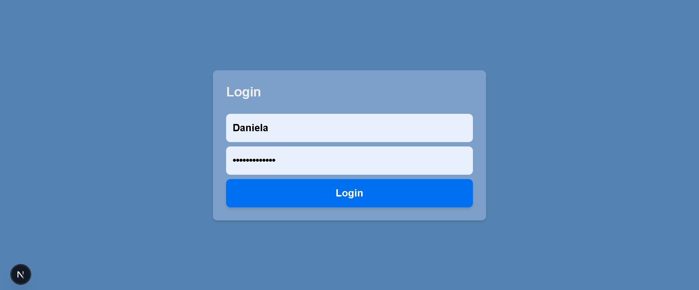
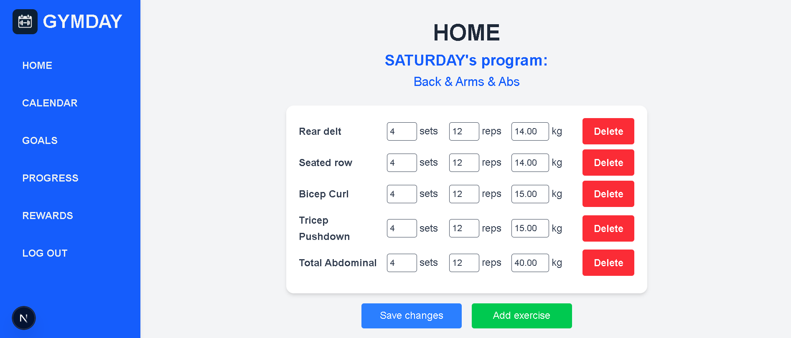
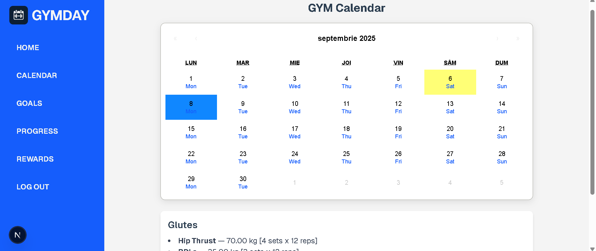

# 🏋️‍♀️ GYMDAY

**GYMDAY** is a fitness web app built with **React, Next.js, and TypeScript**.  
It helps users organize their workout routines, track progress, and manage exercises with ease.  

---

## ✨ Features
- 🔑 User authentication for personalized access  
- 🏠 Home page displaying the workout program of the current day  
- ➕ Add, edit, or remove exercises (sets, reps, weights)  
- 📅 Interactive calendar to view all workouts organized by day  
- 📊 Track progress over time  

---

## 🖼️ Preview

### Login  

### Home – Daily Program  
  

### Calendar  

---

## ⚙️ Technologies
- **React, Next.js, TypeScript**  
- **MySQL + TypeORM** for data management  
- **Postman** for API testing  
- **HTML, CSS, TailwindCSS** for responsive design  
